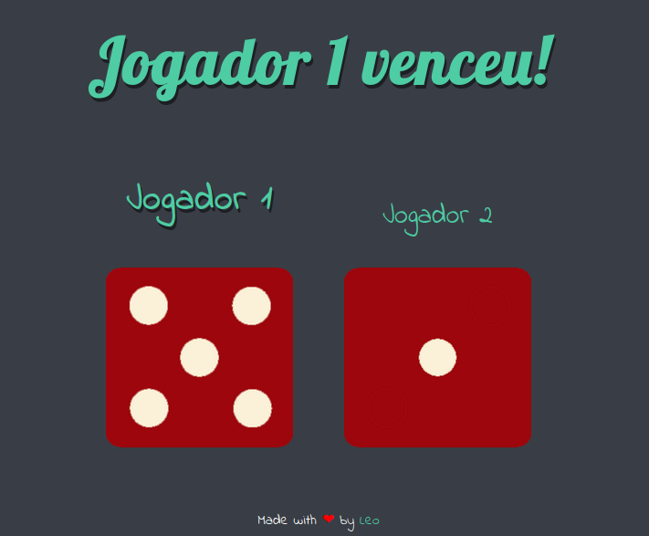

## Jogo de rolagem de dados

Jogo muito simples de sorteamento de dados usando apenas Javascript puro ensinado pela [Angela Yu](https://github.com/angelabauer). Funciona da seguinte maneira: os dados são "rolados" pra uma face aleatória cada vez que o usuário recarrega a página. O jogo aponta o vencedor (o dado de maior valor).

